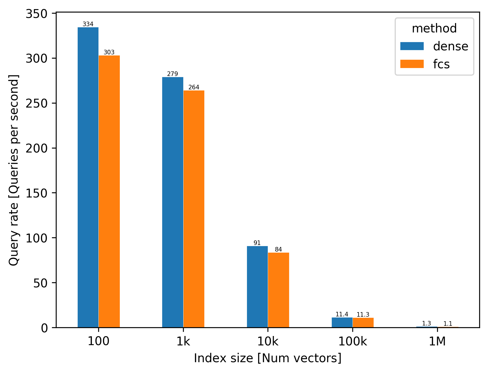
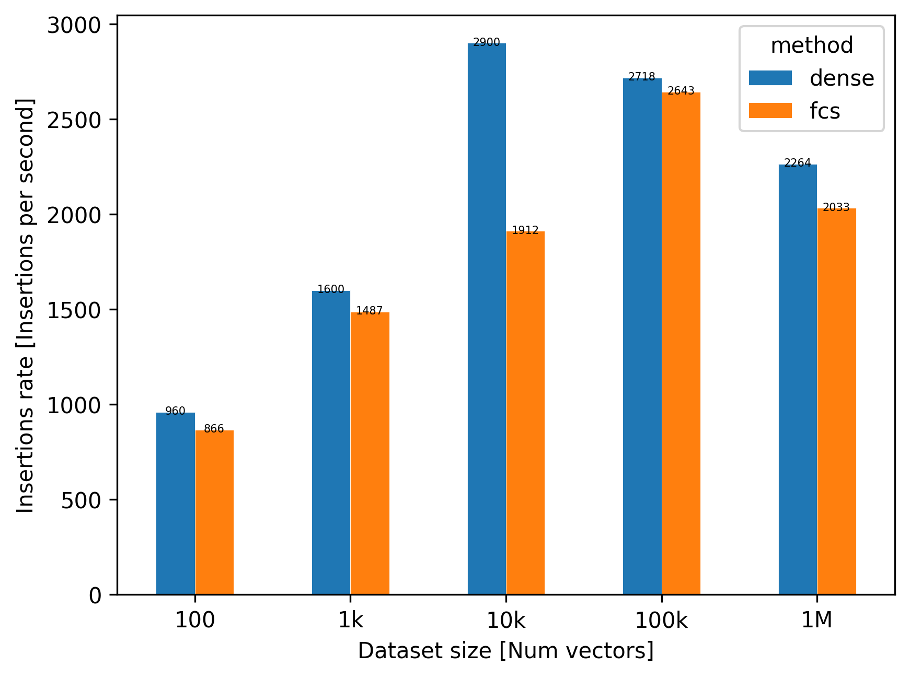

# Elasticsearch nearest neighbour vector scoring benchmarks

Performance evaluation of vector nearest neighbour solutions
in Elasticsearch. 

## Run the evaluation

### <a name="prereqs"></a> Prerequisites

Docker resources: Ensure your Docker is configured with sufficient
resources for reliable performance results. For reference, our original
experiments were run with the following set up:
- Hardware: MacBook Pro, 15-inch, 2018; 2.6 GHz Intel Core i7; 6 cores;
  16 GB RAM.
- Docker: Docker for Mac 2.1.0.3; Docker Engine 19.03.2; 11 GiB memory,
  6 CPUs; 1 GiB swap. 

Install dependencies:

```bash
pipenv sync
```

Do all data preparation for experiments to be excuted. This will involve
downloading a large (1GB+) dataset of vectors: 

```bash
pipenv run invoke prep
```

### Run experiments

Execute all experiments with:

```bash
pipenv run python -m experiments
```

Measurements can be found in `reports/results.csv`.

## Methodology

### Experimental setup

See [above](#prereqs) the hardware that ran these results. See docker file
for software versions.

Indexes were configured as single shard and single replica. Experiments
do *not* take take direct action to normalise cold vs warm cache
scenarios.

### Nearest neighbour implementations

**`dense`**: Elasticsearch's vector scoring functionality introduced in
version 7.3. Relies on the [dense vector](https://www.elastic.co/guide/en/elasticsearch/reference/master/dense-vector.html)
datatype.

**`fcs`**: The Cookpad fork of the [Fast Cosine Similarity](https://github.com/cookpad/fast-cosine-similarity)
plugin for Elasticsearch. Originally written by [StaySense](https://github.com/StaySense/fast-cosine-similarity) and
subsequently forked into various projects.

## Results

### Query performance



### Insertion performance


